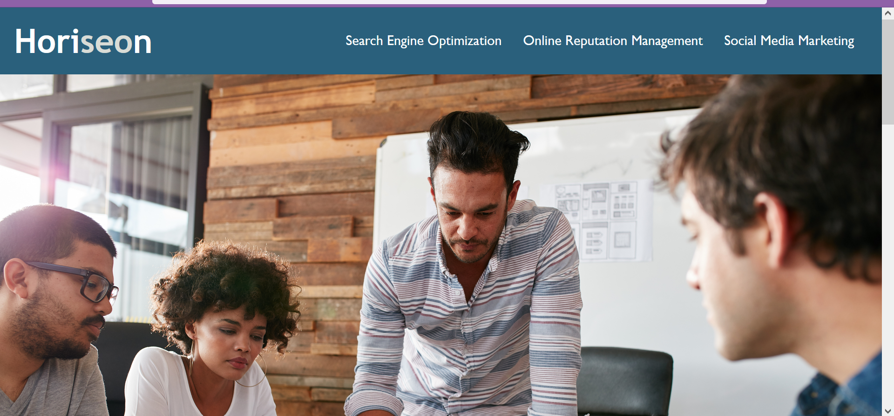
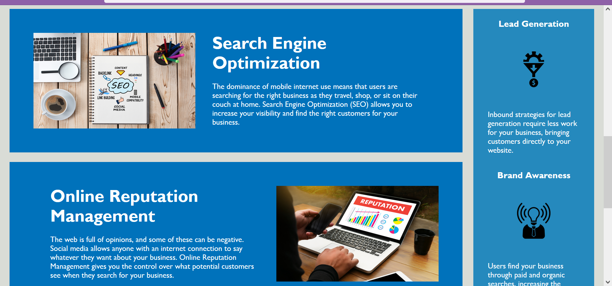

# 01-Horiseon

## Description

This project took an agency's webpage and updated it to meet accessibility standards and improve search engine opimization (SEO). This included updating html code to use semantic elements and updating the css stylesheet to correspond to those semantic changes. The code was streamlined by consolidating the css to avoid repetitive code and by removing class attributes that were no longer necessary after adding semantic elements.

The semantic and accessibility additions to the code will help SEO and accessibility by being clearer about what contains the important information on the page. The consolidation of code, the semantic additions, and the additional comments make the code easier for humans to read and easier to update or change later.

You may visit this page [here](https://emilyk221.github.io/01-Horiseon/).

## Credits

I used the following references: 
- [GitHub Guide on markdown](https://docs.github.com/en/get-started/writing-on-github/getting-started-with-writing-and-formatting-on-github/basic-writing-and-formatting-syntax#links)
- [GitHub cheatsheet](https://education.github.com/git-cheat-sheet-education.pdf)
